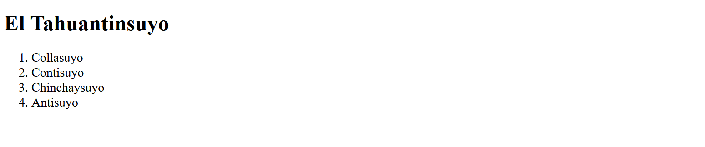

# Codificación

## Funciones de codificación
En _html5svg2_ los documentos HTML se codifican empleando las funciones _dTag_, _dEtq_ y _dCmt_. 
Cada una de estas funciones devuelven una lista de texto codificado de acuerdo a la 
sintaxis del lenguaje de marcas de HTML. Estas listas se introducen &#8212 según corresponda &#8212 
por medio de los métodos _cabecera()_ y _contenido()_ en el objeto de la clase HTML5.

### dTag

```python
dTag(tag, obj, **js)
# tag: marca o etiqueta
# obj: contenido de la marca (texto o lista de texto)
# **js: argumentos clave:valor de la marca
```

La función _dTag()_ se emplea para codificar el marcado que tiene la siguiente forma:
```text
<marca arg0="val0" arg1="val1"> contenido </marca>
```

El ejemplo dado a continuación
```python
dTag('h1', 'Título', style="color:red;")
```
Genera el siguiente resultado
```python
['<h1 style="color:red;">Título</h1>']
```

### dEtq
```python
dEtq(etq, **js)
# etq: marca o etiqueta
# **js: argumentos clave:valor de la marca
```
La función _dEtq()_ se emplea para codificar el marcado que tiene la siguiente forma:
```text
<marca arg0="val0" arg1="val1" />
```
Ejemplo
```python
dEtq('img', src="imagen.png", alt="(imagen)")
```
Resultado 
```python
['']
```

### dCmt
```python
dCmt(obj)
# obj: texto o lista de texto
```
La función _dCmt()_ se emplea para codificar comentarios. Estas no serán visibles
en la página web.

Ejemplo
```python
dCmt('Esto es un comentario')
```
Resultado
```python
['<!-- Esto es un comentario -->']
```

## Codificación de marcado anidado

El siguiente código HTML correspondiente a un ejemplo de una lista ordenada
```html
    <h1>El Tahuantinsuyo</h1>
    <ol style="font-size:14pt">
      <li>Collasuyo</li>
      <li>Contisuyo</li>
      <li>Chinchaysuyo</li>
      <li>Antisuyo</li>
    </ol>
```
se codifica de la siguiente manera
```python
	h = HTML5()
	h.contenido(dTag('h1', 'El Tahuantinsuyo'))
	lst = [
		dTag('li', 'Collasuyo')[0],
		dTag('li', 'Contisuyo')[0],
		dTag('li', 'Chinchaysuyo')[0],
		dTag('li', 'Antisuyo')[0]
	]
	h.contenido(dTag('ol', lst, style="font-size:14pt"))

```
y se mostrará en la página web de la siguiente forma

