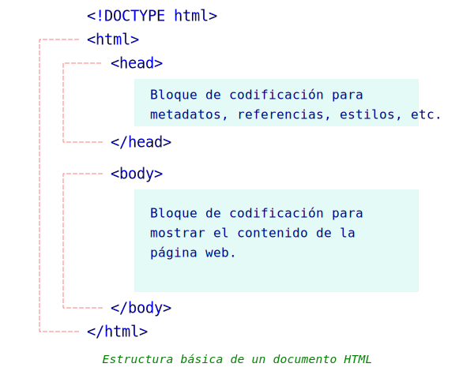

# HTML

## Estructura básica de un documento HTML



## Codificación de una página html con htm5svg2

Básicamente, consta de cuatro pasos.  

1. Crear un objeto a partir de la clase HTML5  
1. Codificar el bloque &#60;head&#62; con el método cabecera()
1. Codificar el bloque &#60;body&#62; con el método contenido()
1. Gravar en un archivo texto.

A continuación se muestra un ejemplo:
```python
from html5svg2 import HTML5, dTag, dEtq

# 1. Crear el objeto de la clase HTML5
h = HTML5()

# 2. Codificar el bloque <head>
h.cabecera(dTag('title','Ejemplo con HTML5SVG2'))
h.cabecera(dEtq('meta', charset='UTF-8'))
h.cabecera(dEtq('meta', name='viewport', content='width=device-width, initial-scale=1.0'))
h.cabecera(dEtq('meta', name='description', content='Una demostración de HTML5SVG2 ..'))
h.cabecera(dEtq('meta', name='keywords', content='HTML, CSS, SVG, JavaScript'))
h.cabecera(dEtq('meta', name='author', content='Borsi F. Romero A.'))
h.cabecera(dEtq('link', rel='stylesheet', type="text/css", href="https://www.w3schools.com/w3css/4/w3.css"))
h.cabecera(dEtq('link', rel='stylesheet', href="https://fonts.googleapis.com/css?family=Architects Daughter|Baumans|Monoton|Mallanna|Bellefair|Josefin Sans:300,600"))
l_stl = [
	"body {background-color: lightblue; font-family: Josefin Sans;}", 
	"h1, h2, h3 {color: blue}"
] 
h.cabecera(dTag('style', l_stl))

# 3. Codificar el bloque <body>
h.contenido(dTag('h1', 'HTML 5 SVG 2 / W3.CSS', **{'class': 'w3-container w3-center w3-blue', 'style': 'font-family:Monoton'}))
lo = dTag('h2', 'Esto es fantástico ...', **{'style': 'font-family:Architects Daughter'})
ls = dTag('header', dTag('h2', 'Los doce apóstoles de Jesús'), **{'class': 'w3-container w3-amber', 'style': 'font-family:Baumans'})
lAp = [
	"Simón, llamado Pedro",
	"Andrés hermano de Pedro",
	"Jacobo hijo de Zebedeo",
	"Juan su hermano",
	"Felipe",
	"Bartolomé",
	"Tomás",
	"Mateo el publicano",
	"Jacobo hijo de Alfeo",
	"Lebeo, por sobrenombre Tadeo",
	"Simón el cananista",
	"Judas Iscariot, el que también le entregó."
]
ls.extend(dTag('ol', [dTag('li', tx)[0] for tx in lAp], style="font-size:16pt"))
ls.extend(dEtq('br'))
lo.extend(dTag('div', ls, **{'class': 'w3-card-4 w3-sand', 'style': 'width:100%;'}))
h.contenido(dTag('div', lo, **{'class': 'w3-container'}))
	
# 4. Archivar	
h.gravar("demo0.html")
```
El resultado se verá tal como se aprecia en la siguiente imagen.

