# SVG

## Sistema de coordenadas
En esta aplicación se la entrada de datos para dibujar
figuras geométricas se emplea el sistema de coordenadas cartesianas.  
Para la definición de marcadores úsese el sistema de coordenadas SVG.

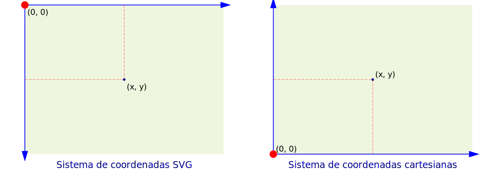

## Figuras geométricas

### Línea

```python
linea(p1, p2, **js)
# p1 = (x1, y1)
# p2 = (x2, y2)
# **js: argumentos clave:valor
```

Ejemplo:
```python
from html5svg2 import SVG2, linea

svg = SVG2('ajustable', W=330, H=130, letra="Consolas", color_fondo="rgb(240,250,240)")
svg.cuadricula(10, style="stroke:green;stroke-width:0.1px;")

l_db = [
	linea((10, 90), (150, 120), style="stroke:red;stroke-width:0.5px;"),
	linea((10, 70), (150, 100), style="stroke:red;stroke-width:5px;"),
	linea((10, 50), (150, 80), style="stroke:red;stroke-width:10px;"),
	linea((10, 30), (150, 60), style="stroke:blue;"),
	linea((10, 10), (150, 40), style="stroke:black;"),
	linea((180, 100), (320, 100), style="stroke:black;stroke-dasharray:10 2"),
	linea((180, 80), (320, 80), style="stroke:black;stroke-dasharray:10 5"),
	linea((180, 60), (320, 60), style="stroke:black;stroke-dasharray:5"),
	linea((180, 40), (320, 40), style="stroke:black;stroke-dasharray:10"),
	linea((180, 20), (320, 20), style="stroke:black;"),
]

for db in l_db:
	svg.dibujar(db)

svg.gravar("linea.svg")
```

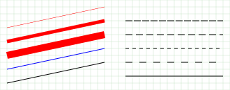

### Polilinea
```python
polilinea(pts, **jx)
# pts: lista de puntos [(x,y), ..]
# **js: argumentos clave:valor
```
Ejemplo:
```python
from html5svg2 import SVG2, polilinea

svg = SVG2('ajustable', W=330, H=130, letra="Consolas", color_fondo="rgb(250,250,230)")
svg.cuadricula(10, style="stroke:SlateBlue;stroke-width:0.1px;")
pts_1 = [(130, 30), (80, 30), (80, 10), (10, 65), (80, 120), (80, 100), (130, 100)]
pts_2 = [(200, 30), (250, 30), (250, 10), (320, 65), (250, 120), (250, 100), (200, 100)]
svg.dibujar(polilinea(pts_1, style="fill:none;stroke:blue;"))
svg.dibujar(polilinea(pts_2, style="fill:gold;stroke:blue;"))
svg.gravar("polilinea.svg")
```

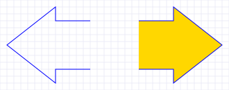

### Polígono
```python
poligono(pts, **jx)
# pts: lista de puntos [(x,y), ..]
# **js: argumentos clave:valor
```
Ejemplo:
```python
from html5svg2 import SVG2, poligono

svg = SVG2('ajustable', W=330, H=130, letra="Consolas", color_fondo="rgb(250,250,230)")
svg.cuadricula(10, style="stroke:SlateBlue;stroke-width:0.1px;")
pts_1 = [(130, 30), (80, 30), (80, 10), (10, 65), (80, 120), (80, 100), (130, 100)]
pts_2 = [(200, 30), (250, 30), (250, 10), (320, 65), (250, 120), (250, 100), (200, 100)]
svg.dibujar(poligono(pts_1, style="fill:none;stroke:blue;"))
svg.dibujar(poligono(pts_2, style="fill:gold;stroke:blue;"))
svg.gravar("poligono.svg")
```

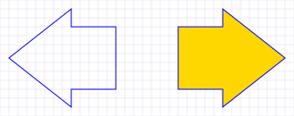

### Polígono regular
```python
poligono_regular(po, n, r, ang, **cv)
# po = (x, y): punto central
# n: número de lados
# r: radio al vértice
# ang: ángulo del vértice inicial
```
Ejemplo:
```python
from html5svg2 import SVG2, poligono_regular

svg = SVG2('ajustable', W=330, H=130, letra="Consolas", color_fondo="rgb(250,250,230)")
svg.cuadricula(10, style="stroke:SlateBlue;stroke-width:0.1px;")

l_db = [
	poligono_regular((80, 65), 5, 60, 18, style="fill:gold;stroke:crimson;"),
	poligono_regular((80, 65), 4, 40, 45, style="fill:yellow;stroke:blue;"),
	poligono_regular((80, 65), 3, 20, -30, style="fill:lime;stroke:green;"),
	poligono_regular((250, 65), 10, 60, 18, style="fill:gold;stroke:crimson;"),
	poligono_regular((250, 65), 8, 40, 45, style="fill:yellow;stroke:blue;"),
	poligono_regular((250, 65), 6, 20, -30, style="fill:lime;stroke:green;"),
]

for db in l_db:
	svg.dibujar(db)
	
svg.gravar("poligono-regular.svg")
```

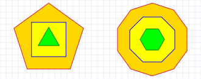

### Rectángulo
```python
rectangulo(px, w, h, **jx)
# px = (x,y) vértice inferior izquierdo del rectángulo
# **js: argumentos clave:valor
#	rx: radio de curvatura en vértices
#	ry: radio de curvatura en vértices
#	ang: ángulo de rotación sobre el vértice px y la horizontal (en grados)
```

Ejemplo:
```python
from html5svg2 import SVG2, rectangulo

svg = SVG2('ajustable', W=330, H=130, letra="Consolas", color_fondo="rgb(250,250,230)")
svg.cuadricula(10, style="stroke:SlateBlue;stroke-width:0.1px;")

stl = "fill:PaleGreen;opacity:0.5;stroke:green;stroke-width:0.5px;"
stl2 = "fill:yellow;opacity:0.5;stroke:magenta;stroke-width:1.5px;"
l_db = [
	rectangulo((20, 20), 50, 30, style=stl),
	rectangulo((20, 80), 50, 30, rx=5, style=stl),
	rectangulo((100, 80), 50, 30, rx=10, ry=5, style=stl),
	rectangulo((100, 20), 50, 30, rx=5, ry=10, style=stl),
	rectangulo((220, 20), 80, 50, style=stl2),
	rectangulo((220, 20), 80, 50, ang=30, style=stl2),
	rectangulo((220, 20), 80, 50, ang=60, style=stl2),
]

for db in l_db:
	svg.dibujar(db)

svg.gravar("rectangulo.svg")
```
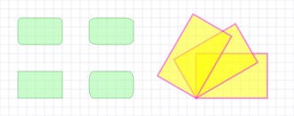

### Círculo
```python
circulo(po, r, **jx)
# po = (x,y): punto central del círculo
# r: radio del círculo
```

Ejemplo:
```python
import math
from html5svg2 import SVG2, circulo

svg = SVG2('ajustable', W=330, H=130, letra="Consolas", color_fondo="rgb(250,250,230)")
svg.cuadricula(10, style="stroke:SlateBlue;stroke-width:0.1px;")

stl1 = "stroke:blue;stroke-width:0.5;fill:gold;opacity:0.6;"
stl2 = "stroke:blue;stroke-width:0.75;fill:cyan;opacity:0.3;"
xo = 165
yo = 65
rd = 50
n = 24
ang = 2 * math.pi / n
sn = math.sin(ang / 2)
r = rd * sn
svg.dibujar(circulo((xo, yo), rd - r, style=stl1))
for i in range(n):
	x = xo + rd * math.cos(ang * i)
	y = yo + rd * math.sin(ang * i)
	svg.dibujar(circulo((x, y), r, style=stl2))

svg.gravar("circulo.svg")
```
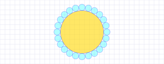

### Elipse
```python
elipse(po, rx, ry, ang, **jx)
# po = (x,y): punto central de la elipse
# rx: radio en el eje X
# ry: radio en el eje Y
# ang: ángulo de rotación sobre el punto po y la horizontal (en grados)
# **js: argumentos clave:valor
```

Ejemplo:
```python
import math
from html5svg2 import SVG2, circulo, elipse

svg = SVG2('ajustable', W=330, H=130, letra="Consolas", color_fondo="rgb(250,250,230)")
svg.cuadricula(10, style="stroke:SlateBlue;stroke-width:0.1px;")

stl1 = "stroke:blue;stroke-width:0.5;fill:gold;opacity:0.6;"
stl2 = "stroke:red;stroke-width:1.5;fill:OrangeRed;opacity:0.3;"
xo = 165
yo = 65
rd = 30
n = 3
ang = 2 * math.pi / n
svg.dibujar(elipse((xo, yo), 25, 25, 0, style=stl1))
for i in range(n):
	x = xo + rd * math.cos(ang * i)
	y = yo + rd * math.sin(ang * i)
	angr = i * 360 / n
	svg.dibujar(elipse((x, y), 30, 10, angr, style=stl2))

svg.gravar("elipse.svg")
```
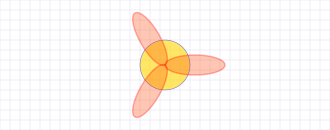


### Trayectoria
```python
trayectoria(ldx, **jx)

```

Ejemplos:
```python
from html5svg2 import SVG2, trayectoria

svg = SVG2('ajustable', W=330, H=130, letra="Consolas", color_fondo="rgb(250,250,230)")
svg.cuadricula(10, style="stroke:SlateBlue;stroke-width:0.1px;")

# Trazado de una onda
ldx = [{'M': (10, 65)}, {'q': [(20, 50), (40, 0)]}, {'q': [(20, -50), (40, 0)]}]
svg.dibujar(trayectoria(ldx, style="stroke:blue;stroke-width:1.5px;fill:none;"))

# Trazado de una aríbalo inca
ldx = [
	{'M': (140, 120)}, {'q': [(-4, 0), (-4, -2)]}, {'q': [(0, -2), (4, -2)]},
	{'q': [(10, 0), (10, -30)]}, {'q': [(-20, -10), (-20, -40)]},
	{'q': [(-5, 0), (-5, -5)]}, {'q': [(0, -5), (5, -5)]},
	{'q': [(0, -20), (25, -20)]},
	{'q': [(5, -5), (10, 0)]},	 # base
	{'q': [(25, 0), (25, 20)]},
	{'q': [(5, 0), (5, 5)]}, {'q': [(0, 5), (-5, 5)]},
	{'q': [(0, 30), (-20, 40)]}, {'q': [(0, 30), (10, 30)]},
	{'q': [(4, 0), (4, 2)]}, {'q': [(0, 2), (-4, 2)]},
	{'z': ''}
]
svg.dibujar(trayectoria(ldx, style="stroke:peru;stroke-width:0.75px;fill:orange;"))

# Trazado de un anillo. Lo 'hueco' se obtiene con fill-rule:evenodd;
ldx = [
	{'M': (240, 65)}, {'a': [(35, 35), 0, 0, 1, (70, 0)]}, 	{'a': [(35, 35), 0, 0, 1, (-70, 0)]},
	{'M': (250, 65)}, {'a': [(25, 25), 0, 0, 1, (50, 0)]}, 	{'a': [(25, 25), 0, 0, 1, (-50, 0)]},
]
svg.dibujar(trayectoria(ldx, style="stroke:blue;stroke-width:1.5px;fill:cyan;fill-rule:evenodd;"))

svg.gravar("trayectoria.svg")
```
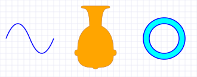

```python
import json
from html5svg2 import SVG2, trayectoria

svg = SVG2('ajustable', W=1200, H=600, letra="Consolas", color_fondo="goldenrod")

with open('jirish-nazca.json') as js:
	ldx = json.load(js)
	
svg.dibujar(trayectoria(ldx, style="fill:none;stroke:white;stroke-width:2px;"))

svg.gravar("jirish-nazca.svg")
```
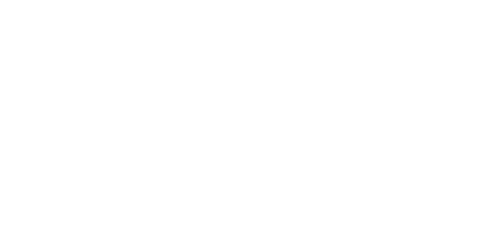


### Arco

```python
arco_circular(po, r, angi, angf, **cv)
arco_eliptico(po, rx, ry, angi, angf, **cv)
# po = (x,y): punto central del círculo o elipse
# r: radio del círculo
# rx: radio de la elipse en el eje X
# ry: radio de la elipse en el eje Y
# angi: ángulo inicial (en grados)
# angf: ángulo final (en grados)
# **js: argumentos clave:valor
```

Ejemplo:
```python
from html5svg2 import SVG2, arco_circular, arco_eliptico

svg = SVG2('ajustable', W=330, H=130, letra="Consolas", color_fondo="rgb(250,250,230)")
svg.cuadricula(10, style="stroke:SlateBlue;stroke-width:0.1px;")
st1 = "fill:none;stroke:blue;stroke-width:2px;"
st2 = "fill:none;stroke:red;stroke-width:2px;"

l_db = [
	arco_circular((80, 65), 50, 00, 120, style=st1),
	arco_circular((80, 65), 50, 120, 360, style=st2),
	arco_eliptico((245, 65), 50, 30, 0, 290, style=st1),
	arco_eliptico((245, 65), 50, 30, 290, 360, style=st2)
]

for db in l_db:
	svg.dibujar(db)
	
svg.gravar("arco.svg")
```

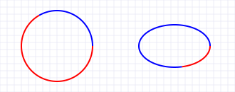

## Texto
```python
texto(px, tx, **jx)
# px = (x,y): punto de ubicación del texto
# tx: texto a mostrar
# **js: argumentos clave:valor
#  ang: ángulo de rotación sobre el punto po y la horizontal (en grados)
```

Ejemplo:
```python
from html5svg2 import SVG2, texto, trayectoria

svg = SVG2('ajustable', W=330, H=150, letra="Consolas", color_fondo="rgb(250,250,230)")
svg.cuadricula(10, style="stroke:SlateBlue;stroke-width:0.1px;")

ldx = [
	{'M': (20, 120)}, {'h': 290}, {'M': (20, 140)}, {'h': 290}, {'M': (80, 5)}, {'v': 80},
	{'M': (190, 20)}, {'h': 130}, {'M': (190, 40)}, {'h': 130}, {'M': (190, 60)}, {'h': 130},
	{'M': (190, 80)}, {'h': 130},
]
stl_ = "stroke:none;fill:royalblue;font-family:Arial;"
stl_1 = f"{stl_}font-size:20px;"
stl_2 = f"{stl_}font-size:10px;"
txt = "20px: abc ABC jql Ñ/Q Ó 0 .. 9"
l_db = [
	trayectoria(ldx, style="stroke:red;stroke-width:0.25px;"),
	texto((165, 120), txt, style=f"{stl_1} text-anchor:middle;"),
	texto((80, 100), "Alineamiento horizontal:", style=f"{stl_2} text-anchor:middle;font-weight:bold"),
	texto((80, 70), "predefinido", style=f"{stl_2}"),
	texto((80, 50), "text-anchor:middle", style=f"{stl_2} text-anchor:middle;"),
	texto((80, 30), "text-anchor:end", style=f"{stl_2} text-anchor:end;"),
	texto((80, 10), "text-anchor:start", style=f"{stl_2} text-anchor:start;"),
	texto((250, 100), "Alineamiento vertical:", style=f"{stl_2} text-anchor:middle;font-weight:bold"),
	texto((190, 80), "dominant-baseline:auto", style=f"{stl_2} dominant-baseline:auto;"),
	texto((190, 60), "dominant-baseline:middle", style=f"{stl_2} dominant-baseline:middle;"),
	texto((190, 40), "dominant-baseline:central", style=f"{stl_2} dominant-baseline:central;"),
	texto((190, 20), "dominant-baseline:hanging", style=f"{stl_2} dominant-baseline:hanging;"),
	texto((165, 75), "texto rotado", ang=45, style=f"{stl_2} text-anchor:middle;"),
]

for db in l_db:
	svg.dibujar(db)
	
svg.gravar("texto.svg")
```
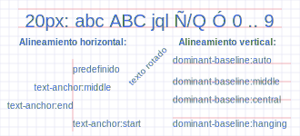

## Rotar

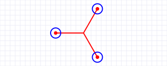
