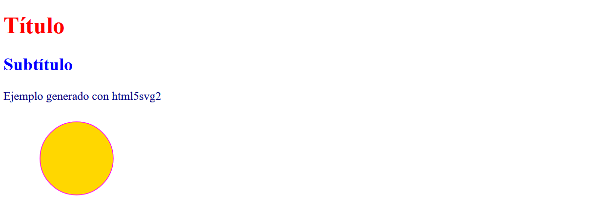

# Guía de uso de HTML5SVG2


## Acerca de _html5svg2_

Es una utilidad para generar reportes en formato HTML 
(_HyperText Markup Language_) y SVG (_Scalable Vector Graphics_) 
en aplicaciones de Python.

Para su uso, se requiere por parte del usuario un conocimiento básico del lenguaje 
de marcado HTML y SVG.

Si requiere aprender sobre HTML, SVG y temas afines, un buen tutorial lo encuentra en 
<a href="https://www.w3schools.com" target="_blank"> www.w3schools.com </a>


## Instalación

```commandline
pip install html5svg2
```

## Ejemplo de uso

```python
from html5svg2 import dTag, dEtq, HTML5, SVG2, circulo

# Crear el objeto de la clase HTML5
h = HTML5()

# Codificar el bloque <head>
h.cabecera(dTag('title','Ejemplo con HTML5SVG2'))
h.cabecera(dEtq('meta', charset='UTF-8'))

# Codificar el bloque <body>
h.contenido(dTag('h1', 'Título', style='color:red'))
h.contenido(dTag('h2', 'Subtítulo', style='color:blue'))
h.contenido(dTag('p', 'Ejemplo generado con html5svg2', style='color:navy'))

# Incluir gráfico SVG
s = SVG2(W=200, H=120)
s.dibujar(circulo((100, 60), 50, style="stroke:magenta;fill:gold"))
h.contenido(s.exp())
	
# Archivar	
h.gravar("reporte.html")

```
Vista resultante:  

